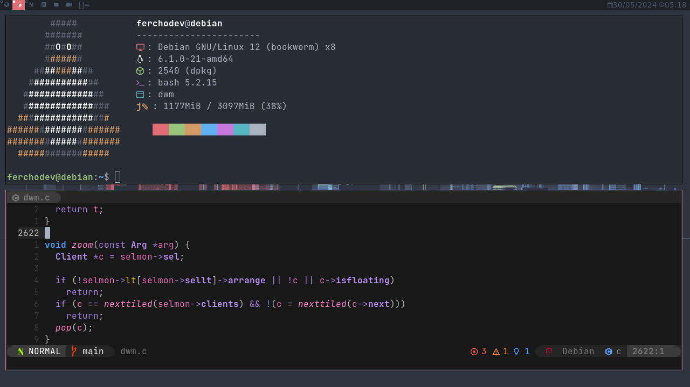

# My build of dwm - dynamic window manager



## How to install dwm

First, install dependencies

```bash

sudo apt install build-essential git libx11-dev libxft-dev libxinerama-dev

```

then clone this repo

```bash

git clone https://github.com/Ferchuepessoadev/dwm.git

```

then build and install

```bash
cd dwm
sudo make clean install
```

then copy the file autostart.sh to ~/.local/share/dwm/autostart.sh

```bash
cp -r autostart.sh ~/.local/share/dwm/autostart.sh
```

then copy dwmbar folder to .config/dwmbar

```bash

cp -r dwmbar ~/.config/dwmbar

```

finally, run dwm
